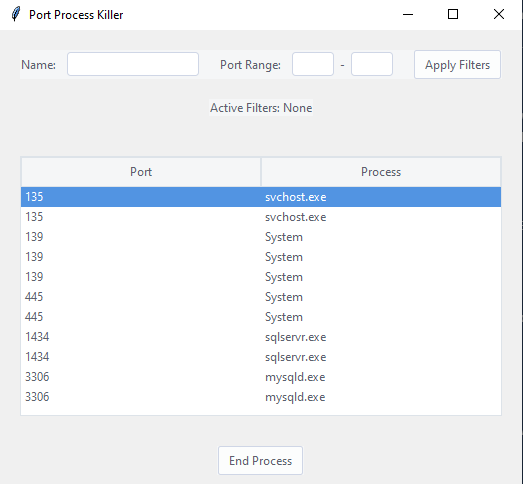

# Ports & Processes Viewer

In the realm of software development and system administration, managing processes and the ports they bind to is a recurring task. For me, it always felt like a game of hide-and-seek, wading through terminal commands, searching for that elusive process holding onto a port I needed. The frustration grew each time I had to list apps running on specific ports and then manually terminate them. Was there no simple tool to visualize, filter, and manage these processes?

Enter the Ports & Processes Viewer.

A simple yet effective GUI application that not only displays listening ports and their associated processes but also provides functionalities that were born out of pure frustration.

## Features:

- **Ease of Viewing**: No more command-line jargons. A clean list of listening ports and their associated processes.
- **Filtering Capabilities**:
  - By process name.
  - By port range.
- **One-Click Termination**: Terminate processes straight from the interface (use with caution).
- **Modern UI**: A sleek interface with filter and port range input at the top and an active filters display.

## Installation:

1. Clone this repository:

```bash
git clone https://github.com/abdellahi-brahim/Port-Process-Killer
```

2. Install dependencies:

```bash
pip install -r requirements.txt
```

3. Run the application:

```bash
python main.py
```

## Screenshots
